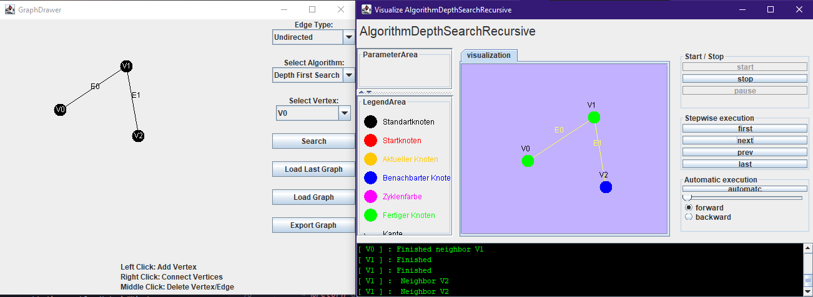

# Tiefensuche und Topologische Sortierung in Graphen animiert

Dieses Projekt bietet die Möglichkeit Algorithmen über gezeichnete und importierte Graphen laufen zu lassen. Entwickelt wurden eine Tiefensuche mit Stapelimplementierung und eine topologische Sortierung.

Dieses Projekt verwendet das OpenJDK-22 von Oracle, es setzt das Java SE 16.0 voraus.

## Ausführung

Sofern keine kompilierte .JAR vorhanden ist, kann das Projekt beispielsweise in JetBrains IntelliJ kompiliert werden, dafür ist es wichtig, `./src/Main.java` als Main Klasse anzugeben und zu verwenden.

Außerdem ist `VisualizationFramework.jar` in `./lib` unter der Projektstruktur als Bibliothek anzugeben.

## Benutzung

Nach dem Start der Anwendung wird der Nutzer mit dem sogenannten `GraphDrawer` Fenster begegnet (siehe Screenshot). In diesem Fenster kann der Nutzer mit den Maustasten Knoten und Kanten erstellen und damit einen Graphen bauen. An der rechten Seite des `GraphDrawer` Fensters können weitere Parameter gesetzt werden:

### GraphDrawer

- Edge Type: Legt fest, ob die gezeichneten Kanten gerichtet oder ungerichtet sein sollen
- Select Algorithm: Hier kann der Nutzer festlegen mit welchem Algorithmus der Graph bearbeitet werden soll
  - Hinweis: Die Tiefensuche funktioniert nur bei ungerichteten Graphen, die topologische Suche nur bei gerichteten!
- Select Vertex: Hier kann der Nutzer den Startknoten für die Tiefensuche angeben
- Search: Öffnet das `VisualizeAlgorithm` Fenster mit gezeichnetem Graphen und selektiertem Algorithmus als Eingabe
- Load Last Graph: Stellt den letzten gezeichneten Graphen im `GraphDrawer` wieder her
- Load Graph: Öffnet einen Dialog in welchem der Nutzer eine Graphdatei angeben kann, die gezeichnet werden soll
- Export Graph: Öffnet einen Dialog in welchem der Nutzer auswählen kann, wo eine Datei mit dem aktuell gezeichneten Graphen exportiert werden soll

### VisualizeAlgorithm

- LegendArea: Hier sieht der Nutzer wie verschiedene Zustände der Knoten und Kanten dargestellt werden
- start / stop: zeichnen den Graphen und setzen die Zeichenfläche zurück
- Stepwise execution: Gibt dem Nutzer die Möglichkeit den Algorithmus schrittweise abzuarbeiten
- Automatic execution: Bietet einen Schieberegeler mit dem der Nutzer die Geschwindigkeit der automatisierten Abarbeitung kontrollieren kann
- TextArea: Die schwarze Fläche gibt aktuelle Informationen zum Algorithmus an

## Lizenz

Dieses Projekt ist unter der MIT Lizenz lizenziert - siehe die LICENSE Datei für Details.

## Authoren

Oliver Ilczuk, Bernhard Mebert und Nils Perthel

## Status des Projekts

Nicht mehr aktiv unterstützt
